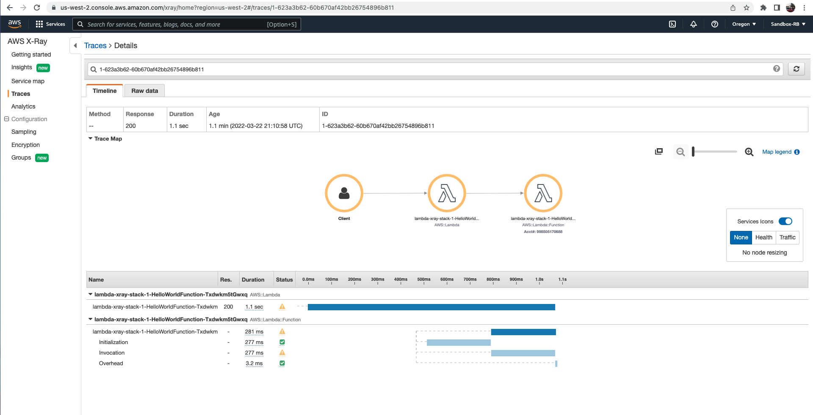
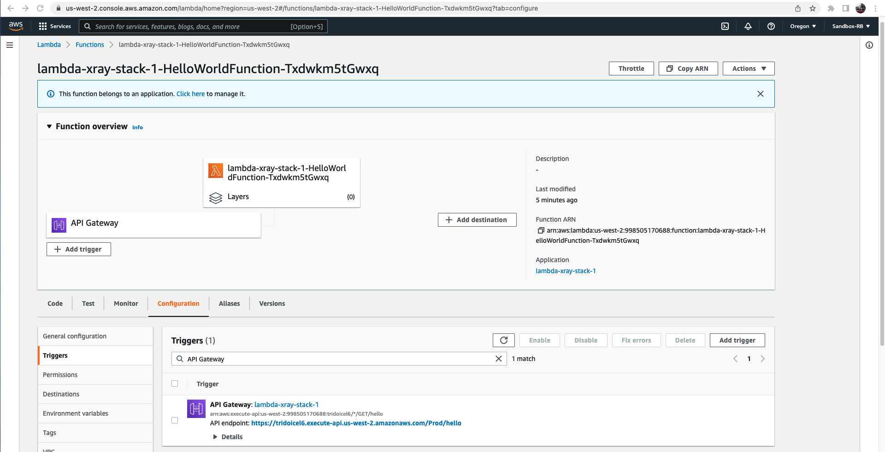
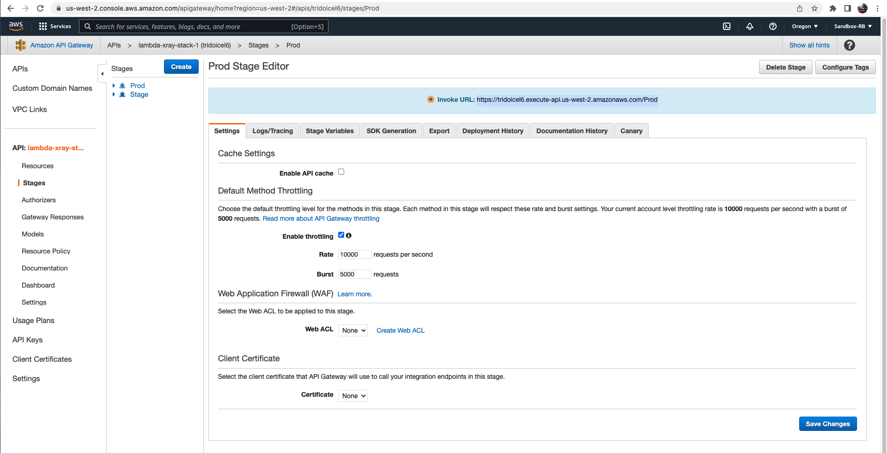
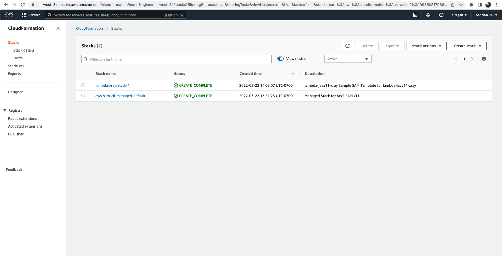

# Pre-requiste #
1. Install maven using brew: 
```html
https://www.appsdeveloperblog.com/how-to-install-maven-on-mac-os/
```

2. Install dependency using 
```js
mvn clean install
```
<b> Note: we must go inside function folder before we run mvn clean install command </b>

## 1. Adding X-ray dependencies for Java ##
```java
<project xmlns="http://maven.apache.org/POM/4.0.0" xmlns:xsi="http://www.w3.org/2001/XMLSchema-instance"
    xsi:schemaLocation="http://maven.apache.org/POM/4.0.0 http://maven.apache.org/maven-v4_0_0.xsd">
    <modelVersion>4.0.0</modelVersion>
    <groupId>helloworld</groupId>
    <artifactId>HelloWorld</artifactId>
    <version>1.0</version>
    <packaging>jar</packaging>
    <name>A sample Hello World created for SAM CLI.</name>
    <properties>
        <maven.compiler.source>11</maven.compiler.source>
        <maven.compiler.target>11</maven.compiler.target>
    </properties>

    <dependencyManagement>
    <dependencies>
      <dependency>
        <groupId>com.amazonaws</groupId>
        <artifactId>aws-xray-recorder-sdk-bom</artifactId>
        <version>2.11.0</version>
        <type>pom</type>
        <scope>import</scope>
      </dependency>
    </dependencies>
  </dependencyManagement>

    <dependencies>
        <dependency>
            <groupId>com.amazonaws</groupId>
            <artifactId>aws-lambda-java-core</artifactId>
            <version>1.2.1</version>
        </dependency>
        <dependency>
          <groupId>com.amazonaws</groupId>
          <artifactId>aws-lambda-java-events</artifactId>
          <version>3.11.0</version>
        </dependency>
        <dependency>
          <groupId>junit</groupId>
          <artifactId>junit</artifactId>
          <version>4.13.2</version>
          <scope>test</scope>
        </dependency>
        <dependency>
          <groupId>com.amazonaws</groupId>
          <artifactId>aws-xray-recorder-sdk-core</artifactId>
        </dependency>
        <dependency>
          <groupId>com.amazonaws</groupId>
          <artifactId>aws-xray-recorder-sdk-apache-http</artifactId>
        </dependency>
        <dependency>
          <groupId>com.amazonaws</groupId>
          <artifactId>aws-xray-recorder-sdk-aws-sdk</artifactId>
        </dependency>
        <dependency>
          <groupId>com.amazonaws</groupId>
          <artifactId>aws-xray-recorder-sdk-aws-sdk-instrumentor</artifactId>
        </dependency>
        <dependency>
          <groupId>com.amazonaws</groupId>
          <artifactId>aws-xray-recorder-sdk-sql-postgres</artifactId>
        </dependency>
        <dependency>
          <groupId>com.amazonaws</groupId>
          <artifactId>aws-xray-recorder-sdk-sql-mysql</artifactId>
        </dependency>
    </dependencies>

    <build>
      <plugins>
        <plugin>
          <groupId>org.apache.maven.plugins</groupId>
          <artifactId>maven-shade-plugin</artifactId>
          <version>3.2.4</version>
          <configuration>
          </configuration>
          <executions>
            <execution>
              <phase>package</phase>
              <goals>
                <goal>shade</goal>
              </goals>
            </execution>
          </executions>
        </plugin>
      </plugins>
    </build>
</project>

```
## Reference ##
- https://docs.aws.amazon.com/xray/latest/devguide/xray-sdk-java.html

## 2. Enable x-ray tracking in .yml file #
```java
Resources:
  HelloWorldFunction:
    Type: AWS::Serverless::Function # More info about Function Resource: https://github.com/awslabs/serverless-application-model/blob/master/versions/2016-10-31.md#awsserverlessfunction
    Properties:
      CodeUri: HelloWorldFunction
      Handler: helloworld.App::handleRequest
      Runtime: java11
      Architectures:
        - x86_64
      MemorySize: 512
      Environment: # More info about Env Vars: https://github.com/awslabs/serverless-application-model/blob/master/versions/2016-10-31.md#environment-object
        Variables:
          PARAM1: VALUE
      Events:
        HelloWorld:
          Type: Api # More info about API Event Source: https://github.com/awslabs/serverless-application-model/blob/master/versions/2016-10-31.md#api
          Properties:
            Path: /hello
            Method: get
      Tracing: Active
```

## Reference ##
- https://docs.aws.amazon.com/lambda/latest/dg/java-tracing.html#java-tracing-api

## 3. Add X-ray permission role in .yml file ##
```java
Resources:
  HelloWorldFunction:
    Type: AWS::Serverless::Function # More info about Function Resource: https://github.com/awslabs/serverless-application-model/blob/master/versions/2016-10-31.md#awsserverlessfunction
    Properties:
      CodeUri: HelloWorldFunction
      Handler: helloworld.App::handleRequest
      Runtime: java11
      Architectures:
        - x86_64
      MemorySize: 512
      Environment: # More info about Env Vars: https://github.com/awslabs/serverless-application-model/blob/master/versions/2016-10-31.md#environment-object
        Variables:
          PARAM1: VALUE
      Events:
        HelloWorld:
          Type: Api # More info about API Event Source: https://github.com/awslabs/serverless-application-model/blob/master/versions/2016-10-31.md#api
          Properties:
            Path: /hello
            Method: get
      Tracing: Active
  
```

# 4. Sanpshots #
## 4.1 X-ray visualization for lambda function ##


## 4.2 Lambda function created with SAM CLI ##


## 4.3 API gateway URL ##


## 4.4 Cloudformation stack ##

