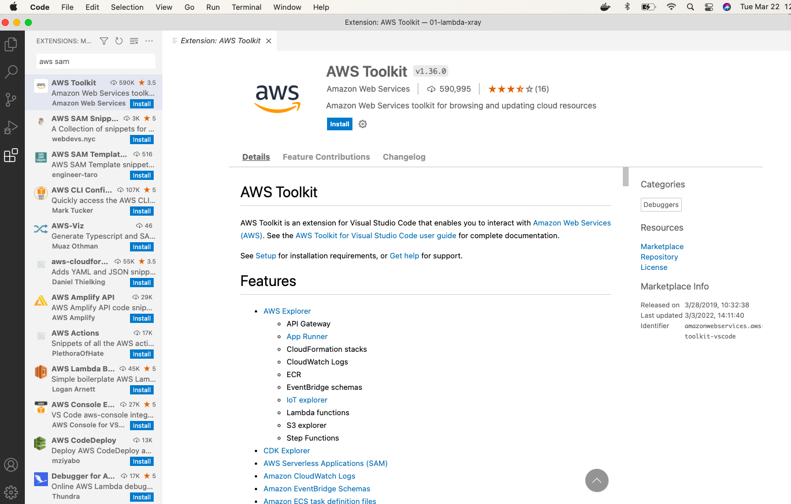
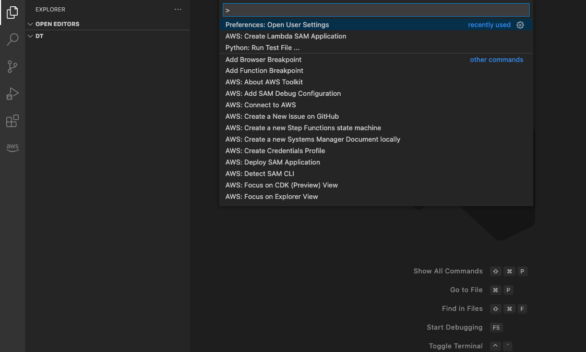
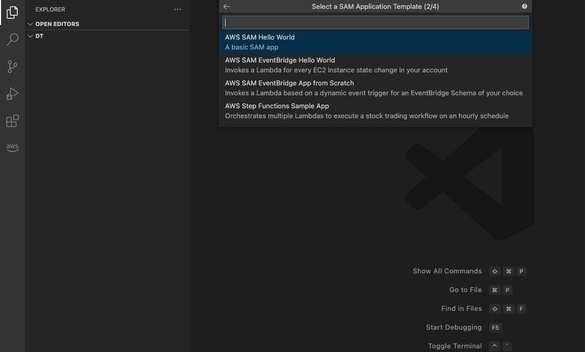
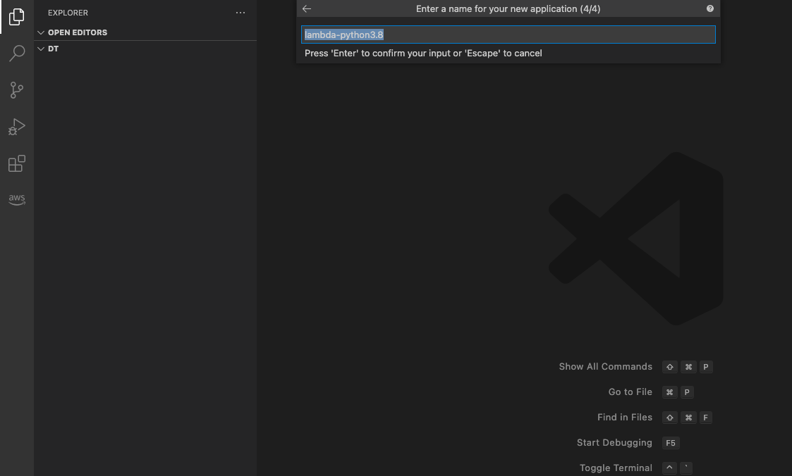

## Major requirements ##
1. Docker has to be installed on the computer.
2. SAM CLI is needed : https://docs.aws.amazon.com/serverless-application-model/latest/developerguide/serverless-sam-cli-install-mac.html

# Creating a lambda function  using command+shift+p #

